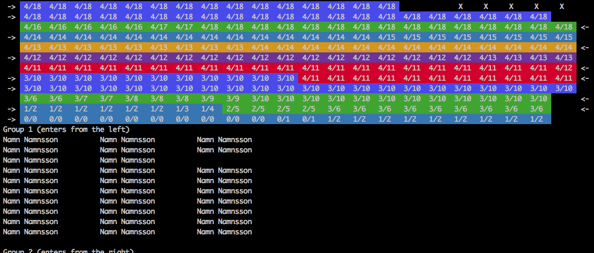

KTH Placeringsverktyg för diplomeringar
=======================================

Vad är det
----------
Uppgiften för detta verktyg är att välja platser för samt dela in diplomander i grupper som ska gå i processionen under diplomeringsdagarna som KTH har. Diplomeringarna hålls i Stadshuset i Stockholm där det kommer finnas uppställt ett antal rader med ett visst antal platser på.
Diplomanderna ska först gå i grupper i den så kallade processionen. Dessa grupper ska om möjligt väljas så att olika program och skolor inte blandas. Efter detta ska de sätta sig på bänkarna. Ordningen som diplomanderna ska sitta på bänkarna är sedan tidigare bestämd, men om det finns tomma platser så är det fortfarande många möjliga placeringar av diplomanderna.

Programmet kommer att spotta ur sig en placering av diplomanderna samt deras uppdelning i processionsgrupper.

Hur används det
---------------
Detta program kan köras på unix-liknande system (t.ex Linux eller macOS).
Det kräver en terminal som stödjer 24-bitars färger, men det gör de flesta moderna terminaler.

~~~
git clone (this repository)
cd (new folder)
./run.sh examples/2017-05-31
~~~

Input
-----
Programmet tar en sökväg till en mapp som input. Denna mapp ska innehålla 2 filer.

### config.json
En JSON fil med diverse inställningar.
~~~
{
	"rows": 12,            <- antal rader
	"columns": 22,         <- antal platser per rad
	"reservedSeats": 5,    <- reserverade platser längst till höger på första raden 
	"groups": 9,           <- antal processionsgrupper
	"weights": [
		{
			"program": 0.0089,  <- Hur dåligt det är att en processionsgrupp innehåller flera olika program
			"school": 1.7,      <- Hur dåligt det är att en processionsgrupp innehåller flera olika skolor
			"size": 37          <- Hur dåligt det är att processionsgrupperna är stora
		}
	]
}
~~~

### input.txt
En fil på formatet
~~~
Namn på skola

Namn på program
Förnamn<tab>Efternamn
Förnamn<tab>Efternamn
...

Namn på program
Förnamn<tab>Efternamn
...

Namn på skola

Namn på program
Förnamn<tab>Efternamn
...

...
~~~

Notera att innan en ny skola så är det 2 tomma rader och innan ett nytt program så är det 1 ny skola.
`<tab>` är alltså tab-symbolen, inte ett mellanslag eller något annat.